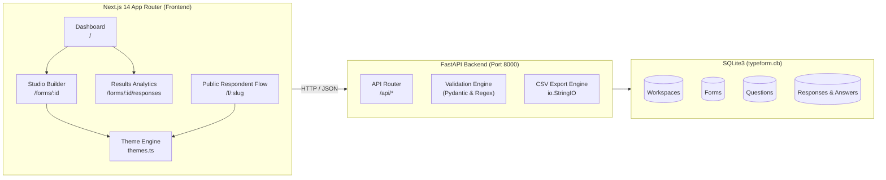
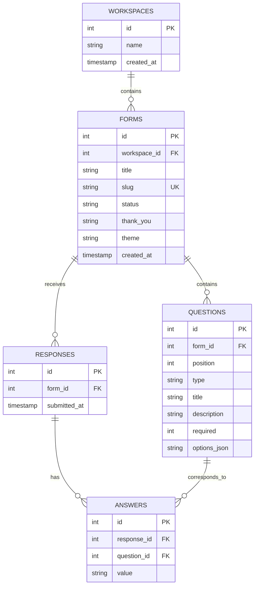

# 🚀 Typeform Clone

A full-stack, pixel-crafted clone of **Typeform** featuring multi-workspace management, an interactive live form builder studio, a dynamic 4-theme gallery engine, a distraction-free keyboard-driven respondent flow, and real-time response analytics.

[](https://nextjs.org/)
[](https://fastapi.tiangolo.com/)
[](https://www.typescriptlang.org/)
[](https://www.python.org/)
[](https://www.sqlite.org/)
[](https://opensource.org/licenses/MIT)

[](https://vercel.com/new/clone?repository-url=https%3A%2F%2Fgithub.com%2Fpraneethmorla%2Ftypeform-clone&root-directory=frontend)

---

## 📑 Table of Contents
1. [Features](#-features)
2. [Architecture Overview](#-architecture-overview)
3. [Database Schema](#-database-schema)
4. [API Overview](#-api-overview)
5. [Theme Engine](#-theme-engine)
6. [Local Setup & Installation](#-local-setup--installation)
7. [Deployment & Hosted Demo](#-deployment--hosted-demo)
8. [Docker Support](#-docker-support)

---

## ✨ Features

### 🏢 Workspaces & Dashboard
- **Workspaces CRUD**: Create, rename, delete workspaces with form counters.
- **Form Management**: Create, rename, duplicate, delete, and move forms between workspaces.
- **Search & Filter**: Real-time form title search, list/grid view toggle, and sorting (Newest, Oldest, Title, Responses).
- **Publish Workflow**: One-click toggle between `draft` and `published` states.

### 🎨 Studio Form Builder (Authentic Typeform UI)
- **3-Column Studio Layout**:
  - **Left Sidebar**: Page cards, reorder via drag-and-drop, quick question deletion, and endings selector.
  - **Center Canvas**: Interactive live preview stage with real-time responsive **Desktop** and **Mobile** device toggles.
  - **Right Inspector**: Question properties, dynamic answer type switcher, required toggle, and live choice editor.
- **Strictly Functional**: Zero dummy/dead placeholder buttons — every visible control works end-to-end.

### 🎭 Live Theme Engine
- **4 Typeform Themes**:
  - `Pearl White`: Clean white canvas with ink typography and charcoal controls.
  - `Classic Blue`: Typeform signature cobalt blue buttons, card borders, and accents.
  - `Inky Black`: Premium dark mode (`#1f1d24`) with white contrast typography and buttons.
  - `Plain Blue`: Soft teal/cyan background with deep emerald accents.
- **Universal Synchronization**: Themes apply in the builder preview, persist to SQLite, and automatically style the live public respondent flow.

### 📝 Respondent Flow (`/f/[slug]`)
- **Single-Question-at-a-Time Slides**: Smooth slide animations for maximum focus and high completion rates.
- **Keyboard Navigation**: Press <kbd>Enter ↵</kbd> to advance, <kbd>↑</kbd> and <kbd>↓</kbd> to navigate questions.
- **Full Question Types**:
  - `Short text` & `Long text`
  - `Multiple choice` (keyboard letters A, B, C...)
  - `Dropdown` select
  - `Email` (client + server regex format validation)
  - `Number` (numerical validation)
  - `Yes / No`
  - `Rating` (5-star interactive picker)
- **Real-Time Progress Bar & Thank-You Screen**: Visual percentage completion bar and customizable ending screen.

### 📊 Results & Analytics (`/forms/[id]/responses`)
- **Summary Cards**: Question-by-question metrics with answer counts, percentage bars, and numeric averages.
- **Response Table**: Tabular submission list with modal response inspection.
- **CSV Export**: One-click standard CSV download via `/api/forms/{id}/export.csv`.

---

## 🏗️ Architecture Overview

The application follows a clean decoupled client-server architecture:



### Directory Structure
```
typeform-clone/
├── backend/
│   ├── main.py              # FastAPI application, database schema, REST endpoints, seed data
│   ├── requirements.txt     # Python dependencies (fastapi, uvicorn, pydantic)
│   └── typeform.db          # SQLite database (auto-generated on startup)
├── frontend/
│   ├── app/
│   │   ├── f/[slug]/        # Public respondent page (single-question slides)
│   │   ├── forms/[id]/      # Studio form builder with live preview canvas
│   │   │   └── responses/   # Response analytics, summary stats, CSV export
│   │   ├── globals.css      # Typeform authentic styling and CSS variables
│   │   ├── layout.tsx       # Root layout
│   │   └── page.tsx         # Dashboard with workspaces and form management
│   ├── lib/
│   │   ├── api.ts           # Fetch API client and TypeScript interfaces
│   │   ├── QuestionInput.tsx# Shared answer control for builder & respondent view
│   │   ├── themes.ts        # Centralized theme definitions and CSS variable generator
│   │   └── toast.tsx        # Toast notification system
│   ├── package.json
│   └── tsconfig.json
├── .gitignore
├── docker-compose.yml       # 1-command local container orchestration
└── README.md
```

---

## 🗄️ Database Schema

The SQLite schema uses foreign keys with `ON DELETE CASCADE` to maintain relational integrity:



### Schema Details
- **`workspaces`**: Organizes forms into distinct folders (`My workspace`, `Marketing`, etc.).
- **`forms`**: Stores title, URL slug, status (`draft` | `published`), completion message, and active `theme` (`pearl`, `classic`, `inky`, `teal`).
- **`questions`**: Ordered by `position`. Preserves question IDs during updates so past submissions remain linked even when the form is edited.
- **`responses`**: Tracks individual submission sessions with timestamps.
- **`answers`**: Normalized key-value entries per question, facilitating instant statistical aggregations (counts, percentages, averages).

---

## 🔌 API Overview

All API endpoints run under `/api/*` and return JSON.

### 1. Workspaces API
| Method | Endpoint | Description |
|---|---|---|
| `GET` | `/api/workspaces` | List all workspaces with form counts |
| `POST` | `/api/workspaces` | Create a new workspace `{ "name": "..." }` |
| `GET` | `/api/workspaces/{id}` | Get workspace details |
| `PUT` | `/api/workspaces/{id}` | Rename workspace |
| `DELETE` | `/api/workspaces/{id}` | Delete workspace and all contained forms |

### 2. Forms API
| Method | Endpoint | Description |
|---|---|---|
| `GET` | `/api/forms?workspace_id={id}` | List forms (optional workspace filter) |
| `POST` | `/api/forms` | Create a new form |
| `GET` | `/api/forms/{id}` | Get full form including ordered questions |
| `PUT` | `/api/forms/{id}` | Update title, thank_you, theme, and questions |
| `POST` | `/api/forms/{id}/move` | Move form to another workspace `{ "workspace_id": 2 }` |
| `POST` | `/api/forms/{id}/duplicate` | Clone form structure and questions |
| `POST` | `/api/forms/{id}/status/{status}` | Update status (`draft` or `published`) |
| `DELETE` | `/api/forms/{id}` | Delete form, questions, and responses |

### 3. Public Respondent API
| Method | Endpoint | Description |
|---|---|---|
| `GET` | `/api/public/{slug}` | Fetch published form configuration for respondent view |
| `POST` | `/api/public/{slug}/responses` | Submit answers `{ "answers": { "qid": "val" } }` with validation |

### 4. Results & Export API
| Method | Endpoint | Description |
|---|---|---|
| `GET` | `/api/forms/{id}/responses` | Get all submissions + question statistics |
| `GET` | `/api/forms/{id}/export.csv` | Download complete responses as a CSV file |

---

## 🎨 Theme Engine

Themes are defined in [`frontend/lib/themes.ts`](frontend/lib/themes.ts) and generate CSS variables:

| Theme ID | Name | Background | Text Color | Button & Accent |
|---|---|---|---|---|
| `pearl` | Pearl White | `#ffffff` | `#191919` | `#191919` |
| `classic` | Classic Blue | `#ffffff` | `#191919` | `#0445af` |
| `inky` | Inky Black | `#1f1d24` | `#ffffff` | `#ffffff` (Dark text) |
| `teal` | Plain Blue | `#e6f4f1` | `#064e3b` | `#0f766e` |

Applied CSS custom properties:
```css
--theme-bg
--theme-color
--theme-muted
--theme-btn
--theme-btn-text
--theme-choice-bg
--theme-choice-border
--theme-choice-text
--theme-choice-sel-bg
--theme-choice-sel-text
--theme-line
```

---

## 💻 Local Setup & Installation

### Prerequisites
- **Node.js**: `v18.0.0` or higher
- **Python**: `3.10` or higher

### 1. Backend Setup
```bash
# Navigate to backend directory
cd backend

# Create virtual environment
python -m venv .venv

# Activate virtual environment
# Windows (PowerShell):
.\.venv\Scripts\Activate.ps1
# macOS / Linux:
source .venv/bin/activate

# Install dependencies
pip install -r requirements.txt

# Start FastAPI server
uvicorn main:app --reload --host 127.0.0.1 --port 8000
```
> The backend runs at `http://127.0.0.1:8000`. Interactive OpenAPI documentation is accessible at `http://127.0.0.1:8000/docs`.

### 2. Frontend Setup
```bash
# Navigate to frontend directory in a separate terminal
cd frontend

# Set up environment variables
cp .env.example .env.local

# Install dependencies
npm install

# Start Next.js development server
npm run dev
```
> The frontend runs at `http://localhost:3000`.

---

## 🌐 Deployment & Hosted Demo

### Option A: Vercel (Frontend) + Render (Backend) [Recommended]
1. **Backend on Render**:
   - Create a new **Web Service** on [Render](https://render.com).
   - Connect the repository: `https://github.com/praneethmorla/typeform-clone`.
   - Set **Root Directory** to `backend`.
   - Build Command: `pip install -r requirements.txt`.
   - Start Command: `uvicorn main:app --host 0.0.0.0 --port $PORT`.
   - Add a persistent disk mounted to `/data` if you wish to retain SQLite data across restarts.
   - Note down your backend URL (e.g., `https://typeform-backend.onrender.com`).

2. **Frontend on Vercel**:
   - One-Click Deploy: [](https://vercel.com/new/clone?repository-url=https%3A%2F%2Fgithub.com%2Fpraneethmorla%2Ftypeform-clone&root-directory=frontend)
   - Or import manually: [Vercel New Project](https://vercel.com/new), select `praneethmorla/typeform-clone`.
   - Set **Root Directory** to `frontend`.
   - Add Environment Variable:
     - `NEXT_PUBLIC_API_URL` = `https://your-backend.onrender.com`
   - Click **Deploy**.
   - Click **Deploy**.

---

## 🐳 Docker Support

To run the full stack locally with a single command:

```bash
docker compose up --build
```

- Frontend: `http://localhost:3000`
- Backend API: `http://localhost:8000`

---

## 📄 License
This project is open-source and available under the [MIT License](LICENSE).
